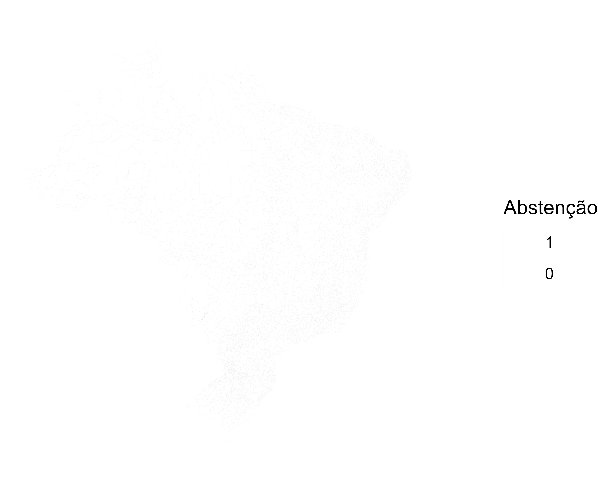
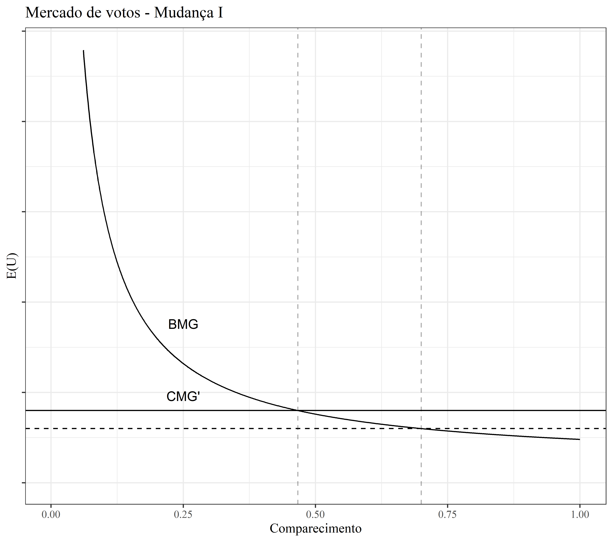
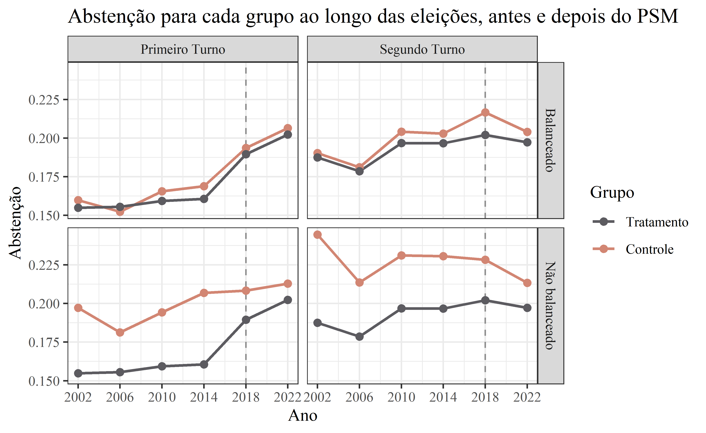

# Background
The brazilian constitution of 1988 has instituted compulsory voting for citizens between the age of 18 and 70. Even obliged by law, approximately 20% of the population does not participate in the elections. 

This research aims to tackle one of the components that determine voter turnout: the voting cost. In 2022, more than 400 out of the 5570 brazilian counties adopted free public transport during the day of the election. The research question is what **was the impact of adopting that measure?**

# Theoretical Model
This research is backed by a microeconomical theoretical framework. The literature on this subject is extensive and the main references used were *Anthony Downs* (1957), *Ricker and Ordershook* (1968), *James Fowler* (2006), *Edlin, Gelman and Kaplan* (2007) and *Smets, van Ham* (2012). The final model adopted was the following:

$$ E(U_v)=\alpha\cdot B_s\cdot N\cdot \left(\frac{K}{V\cdot t}\right)+D-C $$ 

in which

- Candidate preference $(\alpha\cdot B_s\cdot N)$
    - $\alpha:$ An altruism coeficient
    - $B_s:$ Liquid preference between 1st best candidate and 2nd best candidate
    - $N:$ Population, the amount of people recieving the benefit
- Probability of a decisive vote $\left(\frac{K}{V\cdot t}\right)$
    - $K:$ Competitiveness of the election
    - $V:$ Potential voters 
    - $t:$ Turnout
- Autonomous utility $(D-C)$
    - $D:$ Civic duty of voting
    - $C:$ Cost of voting

where if the utility of voting is greater than zero $E(U_v) > 0$, a rational eligible citizen will choose to vote. It's important to note that by this definition, cost also includes the opportunity cost.

In a aggregate level, the equilibrium turnout can be defined by the intersecction between the marginal benefit of voting and the marginal cost of voting. In that point, the citizen will loose the same utility as they gain when voting, which makes them indifferent given the options of voting and not voting.

$$t_{eq}\equiv B_{mg}\cap C_{mg}:\left(\frac{\alpha\cdot B_s\cdot N\cdot K}{V\cdot t}\right)+D=C\\
t_{eq}\equiv\left(\frac{\alpha\cdot B_s\cdot N\cdot K}{V\cdot (C-D)}\right) $$

# Data
Before discussing the data itself, I'd like to endorse https://basedosdados.org/, as most of the data used in this research was collected and organized by them, which contributed a lot to it's progress. 

# Econometric modeling
- Placebo test and parallel trends

- Propensity Score Matching
- Diff-in-Diff

# Results

# Code Reproducibility 
