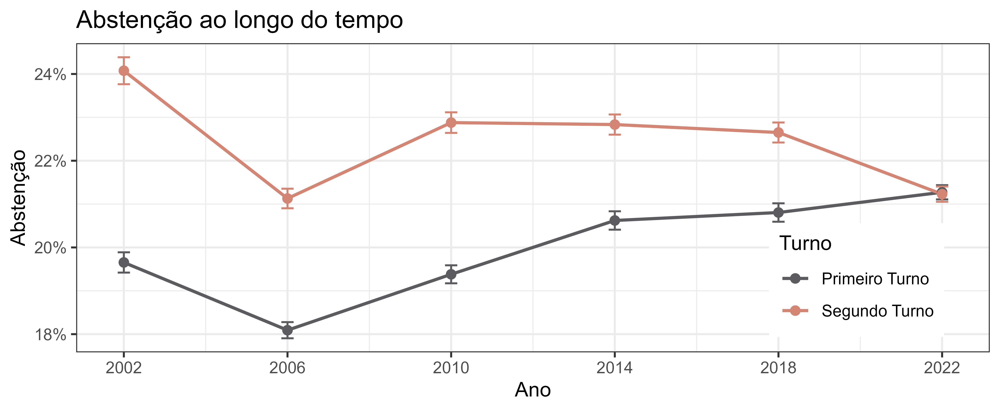

# Background
The brazilian constitution of 1988 has instituted compulsory voting for citizens between the age of 18 and 70. Even obliged by law, approximately 20% of the population does not participate in the elections. 

This research aims to tackle one of the components that determine voter turnout: the voting cost. In 2022, more than 400 out of the 5570 brazilian counties adopted free public transport during the day of the election. The research question is what **was the impact of adopting that measure?**

# Theoretical Model
This research is backed by a microeconomical theoretical framework. The literature on this subject is extensive and the main references used were *Anthony Downs* (1957), *Ricker and Ordershook* (1968), *James Fowler* (2006), *Edlin, Gelman and Kaplan* (2007) and *Smets, van Ham* (2012). The final model adopted was the following:

$$ \bold{E}(U_v)=\alpha\cdot B_s\cdot N\cdot \left(\frac{K}{V\cdot t}\right)+D-C $$ 
in which
- Candidate preference $(\alpha\cdot B_s\cdot N)$
    - $\alpha:$ An altruism coeficient
    - $B_s:$ Liquid preference between 1st best candidate and 2nd best candidate
    - $N:$ Population, the amount of people recieving the benefit
- Probability of a decisive vote $\left(\frac{K}{V\cdot t}\right)$
    - $K:$ Competitiveness of the election
    - $V:$ Potential voters 
    - $t:$ Turnout
- Autonomous utility $(D-C)$
    - $D:$ Civic duty of voting
    - $C:$ Cost of voting

where if the utility of voting is greater than the utility of not voting $\bold{E}(U_v) > \bold{E}(U_a)$, a rational eligible citizen will vote.

In a aggregate level, a change of voting cost caused by free public transport would move the turnout equilibrium to a point with a higher turnout.

# Data
to be continued
