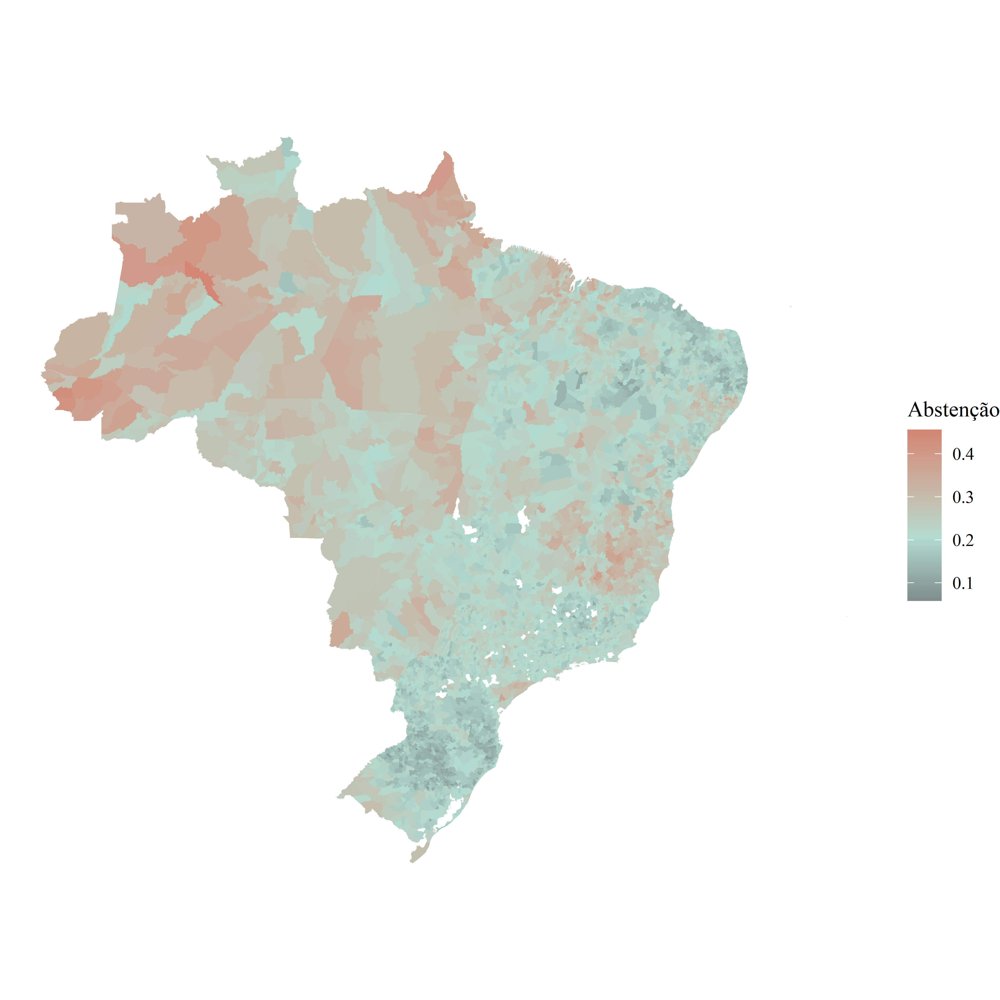

# Passe Livre e Voto: como a mobilidade pode influenciar o comparecimento eleitoral

## Resumo
Nas eleições de 2022, cerca de 400 municípios adotaram o passe livre para os modais de transporte
público no dia da eleição com o objetivo de democratizar o acesso ao voto. A literatura e teoria
microeconômicas indicam que, caso uma medida de redução de “custos de votar” seja implementada de maneira eficiente, é esperado um efeito positivo no comparecimento. Por outro lado, caso
seja implementada com ineficiência, pode haver efeitos adversos, que se configuram como um moral
hazard. Os resultados emp´ıricos deste estudo validam uma série de resultados teóricos discutidos,
mas se demonstraram inconclusivos na identificação da magnitude do efeito do passe livre no comparecimento eleitoral.

---

Os dados utilizados se encontram na pasta “data”, mas no script é possível reproduzir a coleta dos dados utilizando a API da
basedosdados.org.
